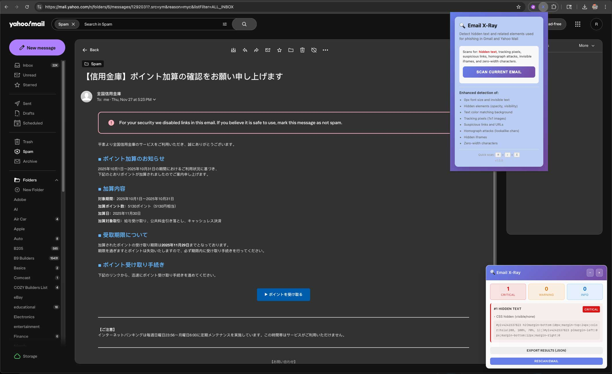

# 🔍 Email X-Ray

**A Chrome extension to detect hidden text in email**


## Overview

Email X-Ray is a security-focused Chrome extension that helps you detect sophisticated phishing tactics used by attackers to hide malicious content in emails. It scans emails in real-time and highlights suspicious elements that might otherwise go unnoticed.

### 🎯 What It Detects

- **Hidden Text**: 0px font size, transparent text, off-screen positioning
- **Tracking Pixels**: 1x1 invisible images used for tracking
- **Suspicious Links**: Data URLs, JavaScript URLs, URL mismatches
- **Homograph Attacks**: Lookalike Unicode characters in URLs
- **Invisible iFrames**: Hidden credential harvesting attempts
- **Zero-Width Characters**: Invisible Unicode characters
- **Suspicious Image Metadata**: Long alt text on hidden images
- **Color Camouflage**: Text color matching background

## Features

✅ **Real-time Scanning**: Analyze emails on-demand with one click  
✅ **Severity Levels**: Critical, Warning, and Info classifications  
✅ **Visual Highlighting**: Color-coded threats directly in the email  
✅ **Detailed Reports**: See exactly what was detected and why  
✅ **Export Results**: Save scan results as JSON for documentation  
✅ **Keyboard Shortcut**: Quick scan with ⌘+⇧+X (Cmd+Shift+X)  
✅ **Privacy-First**: All scanning happens locally, no data leaves your browser  
✅ **Gmail & Yahoo Mail**: Supports both major webmail platforms  

## Installation

### Install from Source (Development)

1. **Clone this repository**:
   ```bash
   git clone https://github.com/artcore-c/email-xray.git
   cd email-xray
   ```

2. **Open Chrome Extensions**:
   - Navigate to `chrome://extensions/`
   - Enable "Developer mode" (toggle in top-right)

3. **Load the extension**:
   - Click "Load unpacked"
   - Select the `email-xray` folder
   - The Email X-Ray icon should appear in your toolbar

## Usage

### Basic Scanning

1. **Open an email** in Gmail or Yahoo Mail
2. **Click the Email X-Ray icon** in your Chrome toolbar
3. **Click "Scan Current Email"**
4. **Review the results** in the panel that appears

### Keyboard Shortcut

Press **⌘+⇧+X** (Mac) or **Ctrl+Shift+X** (Windows/Linux) while viewing an email to instantly scan.

### Understanding Results

The extension displays findings in three severity levels:

- 🔴 **CRITICAL**: Immediate security concern (hidden iframes, invisible text with suspicious content)
- 🟠 **WARNING**: Potentially suspicious (tracking pixels, unusual formatting)
- 🔵 **INFO**: Informational (minor anomalies worth noting)

### Interacting with Results

- **Click on a finding** in the panel to scroll to it in the email
- **Click on highlighted elements** in the email to see detection details
- **Export results** using the "Export Results (JSON)" button for documentation

## How It Works

Email X-Ray uses several detection techniques:

### 1. CSS Analysis
Examines computed styles to find:
- Font size: 0px or < 2px
- Opacity: 0 or near-zero
- Display/visibility: hidden elements
- Color matching: text color ≈ background color
- Positioning: off-screen elements

### 2. Unicode Analysis
Detects invisible characters:
- Zero-width spaces (U+200B)
- Zero-width non-joiners (U+200C)
- Zero-width joiners (U+200D)
- Word joiners (U+2060)
- Other invisible Unicode characters

### 3. Homograph Detection
Identifies lookalike characters:
- Cyrillic 'а' (U+0430) vs Latin 'a' (U+0061)
- Greek 'ο' (U+03BF) vs Latin 'o' (U+006F)
- And 50+ other confusable character pairs

### 4. Link Analysis
Checks for:
- `data:` URLs (can contain encoded payloads)
- `javascript:` URLs (XSS vectors)
- URL vs display text mismatches
- Punycode (xn--) domains

### 5. Tracking Detection
Finds:
- 1x1 pixel images
- Tiny iframes (< 10x10px)
- Hidden iframes with suspicious sources

## Security & Privacy

🔒 **100% Local Processing**: All scans happen in your browser. No data is sent to external servers.

🔒 **Minimal Permissions**: Only requests access to Gmail and Yahoo Mail domains.

🔒 **No Data Collection**: We don't collect, store, or transmit any of your email data.

🔒 **Content Security Policy**: Strict CSP prevents code injection.

🔒 **Open Source**: Full code available for audit and review.

## Browser Compatibility

- ✅ Chrome 88+
- ✅ Chromium-based browsers (Edge, Brave, Opera)
- ✅ macOS, Windows, Linux

## Limitations

- Only works on Gmail and Yahoo Mail web interfaces
- Cannot scan emails in native mail clients
- Some detection methods are heuristic-based (may have false positives/negatives)
- Attachments are not scanned (only email body content)

## Development

### Project Structure

```
email-xray/
├── manifest.json          # Extension configuration
├── content.js            # Main detection logic
├── popup.html            # Extension popup UI
├── popup.js              # Popup interaction handling
├── styles.css            # Visual styling
└── icons/                # Extension icons
    ├── icon16.png
    ├── icon48.png
    └── icon128.png
```

### Building

No build process required. The extension runs directly from source files.

### Testing

Test on sample phishing emails or create test cases with:
- Hidden divs with `style="font-size:0px"`
- Links with `href="javascript:alert(1)"`
- Images with `width="1" height="1"`
- Text with zero-width characters: `Hello\u200BWorld`

## Screenshots

### Detection in Action



The extension showing hidden CSS in a phishing email, 
highlighting suspicious elements and providing detailed analysis in 
the results panel.

## Roadmap

- [ ] Support for additional webmail platforms (Outlook.com, ProtonMail)
- [ ] Configurable sensitivity levels
- [ ] Automatic scanning on email open
- [ ] Machine learning-based threat detection
- [ ] Browser notification alerts
- [ ] Threat intelligence integration

## Contributing

Contributions are welcome! Please feel free to submit a Pull Request.

1. Fork the repository
2. Create your feature branch (`git checkout -b feature/AmazingFeature`)
3. Commit your changes (`git commit -m 'Add some AmazingFeature'`)
4. Push to the branch (`git push origin feature/AmazingFeature`)
5. Open a Pull Request

## License

This project is licensed under the MIT License - see the [LICENSE](LICENSE) file for details.

## Disclaimer

Email X-Ray is a tool to assist in identifying potential phishing attempts. It is not a guarantee of email safety and should be used as part of a comprehensive security strategy. Always exercise caution with suspicious emails.

## Author

Created by Robert - [YouTube Tutorials](#) (coming soon)

## Acknowledgments

- Inspired by the growing sophistication of email phishing attacks
- Built with security and privacy as core principles
- Designed for the security-conscious email user

---

**⚠️ Security Notice**: If you discover a security vulnerability, please contact security@example.com instead of opening a public issue.
