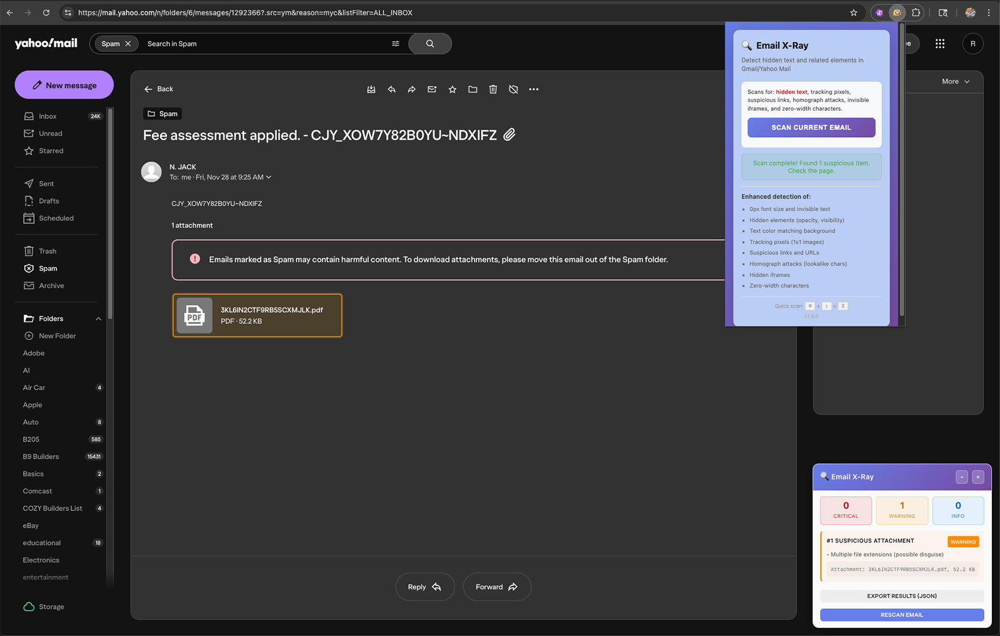
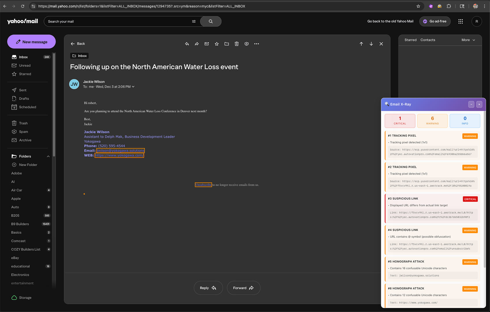

# 🔍 Email X-Ray

**A Chrome extension to detect hidden text in email**

[](CHANGELOG.md)
[](LICENSE)
[](#prerequisites)


## Overview

Email X-Ray is a security-focused Chrome extension that helps you detect sophisticated phishing 
tactics used by attackers to hide malicious content in emails. It scans emails in real-time and 
highlights suspicious elements that might otherwise go unnoticed.

It can detect many of the latest phishing tactics that try to deceive users through visual 
manipulation and technical trickery. The extension examines the email's HTML and CSS to 
find content that's hidden from view, links that don't go where they claim, and other 
suspicious patterns commonly used in phishing attacks.

### Detection Capabilities:

**Hidden content detection** looks for text that's been made invisible through CSS 
manipulation. This includes setting font sizes to zero, making text completely transparent, 
positioning it thousands of pixels off-screen, or using CSS filters and blend modes to render 
it invisible. The scanner also catches color camouflage where text is the same color as the 
background, and detects when clip-path masking is used to hide portions of content.

**Tracking and surveillance** techniques are identified by scanning for tiny 1x1 pixel images, 
SVG elements with zero dimensions, and CSS background images on hidden elements. 
Modern phishing emails often use SVG-based tracking with remote image references that 
phone home when the email is opened.

**Link analysis** examines every URL in the email, checking for data URLs that can hide 
malicious content, JavaScript URLs that execute code, and mismatches between what a link 
displays and where it actually points. The extension analyzes domain names for excessive 
dashes, long random number sequences, suspicious top-level domains like .top or .xyz, and 
brand impersonation patterns where a legitimate company name appears in a fraudulent domain.

**Unicode-based attacks** are caught by detecting confusable characters—lookalike letters 
from different alphabets like Cyrillic or Greek. For example, a Cyrillic 'а' (U+0430) 
looks identical to Latin 'a' (U+0061) but is a different character, allowing attackers 
to create domains like "pаypal.com" that appear legitimate. The scanner checks for punycode domains and uses 
Unicode normalization to catch sophisticated substitution attacks. It also finds zero-width 
invisible characters that can be used to hide tracking codes or manipulate displayed text.

**Email header analysis** examines the reply-to address and compares it against the sender. 
Phishing emails often spoof a legitimate sender but set replies to go to a different address, or 
claim to be from a corporate domain while directing replies to a free Gmail or Yahoo account.

**Attachment inspection** flags files with dangerous extensions like .exe or .scr, double-extension 
tricks like "invoice.pdf.exe", and gibberish filenames with no vowels or all caps 
with numbers. It also notes when attachments use common phishing keywords like 
"invoice", "urgent", or "verify".

**Additional patterns** include detecting invisible iframes that could harvest credentials, 
finding fake unsubscribe mechanisms that use JavaScript or suspicious domains, and 
identifying suspicious image metadata like extremely long alt text on hidden images.

---
## Detection Methods
### 1. Hidden Text Detection
**Scans for CSS-based text hiding techniques:**

- Font size manipulation (0px, <1px)
- Opacity levels (0 or near-transparent <0.1)
- CSS visibility/display properties (`display: none`, `visibility: hidden`)
- CSS filters (`brightness(0%)`, `blur()`)
- Mix-blend-mode concealment
- Color camouflage (text color matches background within 40 RGB difference)
- Off-screen positioning (`text-indent < -100px`, absolute/fixed positioning)
- Clip-path masking

### 2. Tracking Pixel Detection
**Identifies tracking mechanisms:**

- Traditional 1x1 or 2x2 pixel images
- SVG elements with zero dimensions but active viewBox
- Remote SVG `<image>` references to tracking servers
- CSS background-image on hidden elements (width/height ≤2px, display:none, opacity:0)

### 3. Suspicious Link Analysis
**Examines URLs for phishing indicators:**

- Data URLs (`data:`) that can hide malicious content
- JavaScript URLs (`javascript:`) for XSS attempts
- URL/text mismatches (displayed URL differs from href)
- Punycode domains (`xn--`) for IDN homograph attacks
- Excessive dashes (`---`) in domains
- Long numeric sequences (6+ digits, likely auto-generated)
- Suspicious TLDs (.top, .xyz, .click, .link, .tk, .ml, etc.)
- Excessive subdomain depth (>5 levels)
- Brand impersonation (brand name in wrong position)
- @ symbol obfuscation in URLs

### 4. Homograph Attack Detection
**Detects Unicode character substitution:**

- Confusable character mapping (Cyrillic, Greek lookalikes)
- NFKC Unicode normalization for sophisticated attacks
- Tracks 12 confusable character sets (a/а, e/е, o/о, etc.)

### 5. Invisible iFrame Detection
**Finds hidden credential harvesting:**

- Hidden iframes (`display: none`, `visibility: hidden`, `opacity: 0`)
- Tiny iframes (<10x10 pixels)

### 6. Zero-Width Character Detection
**Scans for invisible Unicode characters:**

- Zero-width space (U+200B)
- Zero-width non-joiner (U+200C)
- Zero-width joiner (U+200D)
- Zero-width no-break space (U+FEFF)
- Word joiner (U+2060)
- And 6 other invisible Unicode variants

### 7. Suspicious Image Analysis
**Examines image metadata:**

- Long alt text (>200 chars) on hidden/tiny images
- Zero-width characters in alt attributes

### 8. Suspicious Attachment Detection
**Identifies malicious file downloads:**

- Dangerous extensions (.exe, .scr, .bat, .cmd, .vbs, .js, .jar, .apk, .msi)
- Double extension tricks (file.pdf.exe)
- Gibberish filenames (no vowels, all caps with numbers)
- Common phishing names (invoice, urgent, verify, payment, etc.)
- External hosting (not on Gmail/Yahoo servers)

### 9. Unsubscribe Link Spoofing
**Detects fake unsubscribe mechanisms:**

- JavaScript unsubscribe links
- Data URL unsubscribe forms
- Suspicious TLDs in unsubscribe links
- Embedded forms in email body (legitimate emails use links)

### 10. Reply-To Spoofing
**Identifies email header manipulation:**

- Domain mismatch (FROM vs REPLY-TO)
- No-reply sender but replies enabled
- Corporate sender with free email reply-to (Gmail/Yahoo/Outlook)

### 11. Enhanced CSS Techniques
**Advanced hiding methods:**

- Backdrop-filter detection
- Complex filter chains
- Blend mode analysis

---
## Features

**Scan Trigger:** Click extension icon or use keyboard shortcut `(Cmd/Ctrl+Shift+X)`

### Export Capability: 

**JSON export** with structured findings data including element tags, classes, and threat details

### Privacy Architecture:

**100% local processing** - no network requests

No data collection or external API calls

Minimal permissions (activeTab, storage)

Host permissions limited to mail.google.com and mail.yahoo.com only

**Platform Support:** Gmail and Yahoo Mail (desktop web versions)

## Prerequisites

### Download and install latest Chrome (or any Chromium-based browser, eg. Edge, Brave, Opera)
```zsh
curl -L "https://dl.google.com/chrome/mac/stable/GGRO/googlechrome.dmg" -o ~/Downloads/googlechrome.dmg
open ~/Downloads/googlechrome.dmg
```
**Recommended: Use the latest version of your browser for best compatibility and security**

## Installation

### Install from Source (Development)

1. **Clone this repository**:
   ```bash
   git clone https://github.com/artcore-c/email-xray.git
   cd email-xray
   ```

2. **Open Chrome Extensions**:
   - Navigate to `chrome://extensions/`
   - Enable "Developer mode" (toggle in top-right)

3. **Load the extension**:
   - Click "Load unpacked"
   - Select the `email-xray` folder
   - The Email X-Ray icon should appear in your toolbar

## Usage

### Scanning Email

1. **Open an email** in Gmail or Yahoo Mail
2. **Click the Email X-Ray icon** in your Chrome toolbar
3. **Click "Scan Current Email"**
4. **Review the results** in the panel that appears

### Keyboard Shortcut

Press **⌘+⇧+X** (Mac) or **Ctrl+Shift+X** (Windows/Linux) while viewing an email to instantly scan.

### Understanding Results

The extension displays findings in three severity levels:

🔴 **CRITICAL:** Immediate security concern (hidden iframes, invisible text with suspicious content)
 
🟠 **WARNING:** Potentially suspicious (tracking pixels, unusual formatting)
 
🔵 **INFO:** Informational (minor anomalies worth noting)
 

### Interacting with Results

- **Click on a finding** in the panel to scroll to it in the email
- **Click on highlighted elements** in the email to see detection details
- **Export results** using the "Export Results (JSON)" button for documentation

## Browser Compatibility

- Chrome 88+
- Chromium-based browsers (Edge, Brave, Opera)
- MacOS, Windows, Linux

## Limitations

- Intended for use with Gmail and Yahoo Mail web interfaces only
- Cannot scan emails in native mail clients
- Some detection methods are heuristic-based (may have false positives/negatives)
- Attachments are not scanned (only email body content)

## Development

### Project Structure

```
email-xray/
├── manifest.json          # Extension configuration
├── content.js            # Main detection logic
├── popup.html            # Extension popup UI
├── popup.js              # Popup interaction handling
├── styles.css            # Visual styling
└── icons/                # Extension icons
    ├── icon16.png
    ├── icon48.png
    └── icon128.png
```

### Building

No build process required. The extension runs directly from source files.

### Testing

Test on sample phishing emails or create test cases with:
- Hidden divs with `style="font-size:0px"`
- Links with `href="javascript:alert(1)"`
- Images with `width="1" height="1"`
- Text with zero-width characters: `Hello\u200BWorld`

## Screenshots

###  > Detection in Action


The extension showing hidden CSS in a phishing email, 
highlighting suspicious elements and providing detailed analysis in 
the results panel.


Attachment analysis revealing a potentially malicious file attachment.


Comprehensive scan revealing brand impersonation with phony links, multiple 
tracking pixels (1x1 images), and homograph attacks using confusable Unicode 
characters.

## Contributing

Contributions are welcome! Please feel free to submit a Pull Request.

1. Fork the repository
2. Create your feature branch (`git checkout -b feature/AmazingFeature`)
3. Commit your changes (`git commit -m 'Add some AmazingFeature'`)
4. Push to the branch (`git push origin feature/AmazingFeature`)
5. Open a Pull Request

## License

This project is licensed under the MIT License - see the [LICENSE](LICENSE) file for details.

## Disclaimer

Email X-Ray is a tool to assist in identifying potential phishing attempts. It is not a guarantee of email safety and should be used as part of a comprehensive security strategy. Always exercise caution with suspicious emails.

## Author
Created by Unicorn-1

[](https://youtu.be/HFwb4tjEbTQ)

## Acknowledgments

- Inspired by the growing sophistication of email phishing attacks
- Built with security and privacy as core principles
- Designed for the security-conscious email user

---

**⚠️ Security Notice**: 

Email X-Ray is a detection tool, not a protection layer. It helps identify suspicious patterns but cannot guarantee complete safety. The extension may miss sophisticated attacks or flag legitimate content (false positives/negatives are possible with heuristic detection).
#### Best Practices:

- Never click links or download attachments from suspicious emails, even after scanning
- Remember that hidden elements may exist beneath visible content - avoid clicking anywhere in flagged emails
- If the extension detects threats, report the email to your email provider's spam/phishing system
- For emails impersonating legitimate companies, report directly to that company's official abuse/security contact
- Use Email X-Ray as one tool in a broader security strategy, not as your only defense

The extension runs entirely in your browser and sends no data externally. All code is open-source and auditable in this repository.
